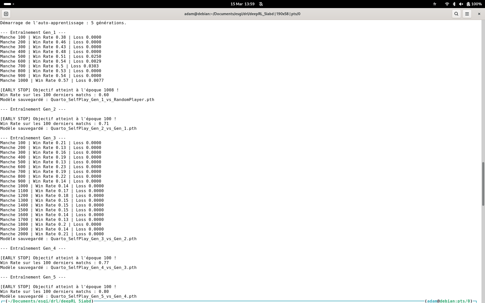

utiliser pytorch tensor pour game aussi psk gpu

## device = torch.device("gpu")
<!-- a = torch.randn((), dtype=dtype, requires_grad=True) -->

# env coder avec python list vs env avec torch tensor

# Gérer le modèle "fort au début"
     commencer a faire les metric a partir de 500 partie, tester sur plusieur seeds

# win rate pas sur le total mais sur les 100 derniere partie

Steps to Convergence : Combien de parties (ou de pas de temps) faut-il pour atteindre un Win Rate de X% ? Liste des paliers à atteindre (ex: [0.5, 0.6, 0.7])
episodes_to_threshold, time_to_threshold

# Episode Length
Le nombre de coups par partie.
Interprétation : Si l'agent gagne et que la durée diminue, il devient efficace. S'il perd et que la durée augmente, il apprend peut-être à "survivre" sans encore savoir gagner.

# Policy Loss

Policy Loss : Dans ton code, c'est la variable loss. Elle doit globalement diminuer, mais attention : en RL, la loss n'est pas aussi lisse qu'en Deep Learning classique.

# Entropy

Entropy : Calcule l'entropie de ta distribution de probabilités Categorical(probs).entropy().

Pourquoi ? Si l'entropie chute trop vite vers 0, l'agent devient "têtu" et arrête d'explorer. S'il ne descend jamais, l'agent reste trop aléatoire.

Qu'est-ce que l'entropie représente concrètement ?Imagine que ton agent a 3 actions possibles : [Gauche, Droite, Sauter].Entropie Maximale (Incertitude totale) :Tes probabilités sont $[0.33, 0.33, 0.33]$. L'agent ne sait pas quoi faire, il choisit au hasard. L'entropie est très élevée. C'est l'état idéal au début de l'entraînement pour explorer le jeu.Entropie Faible (Confiance/Certitude) :Tes probabilités sont $[0.98, 0.01, 0.01]

# Policy Gradient Norm
Policy Gradient Norm : Surveiller la norme des gradients (torch.nn.utils.clip_grad_norm_) aide à détecter les "exploding gradients" qui font crash l'apprentissage.
La norme des gradients est un indicateur de la "force" avec laquelle l'algorithme essaie de modifier les poids de ton réseau de neurones à chaque mise à jour.

# Le score Elo
A. Le "Leaderboard" permanent
Tu maintiens un dictionnaire de scores pour chaque algo (REINFORCE, DQN, Random, PPO).

À la fin de chaque entraînement, tu fais jouer ton modèle final contre les versions sauvegardées des autres.

Tu mets à jour leurs scores Elo respectifs.

# Experience 1

Quand tu fais opponent = current_agent.clone(), tu crées un "miroir" de ton agent. Voici comment l'overfitting stratégique se produit concrètement :

1. Le mécanisme de la "faille"
Imagine que la Gen 1 a appris une règle simple : "Si je mets une pièce ronde dans un coin, je gagne souvent". C'est sa stratégie dominante.

Quand la Gen 2 commence, elle joue contre ce miroir. Elle va rapidement découvrir : "Attends, mon adversaire (Gen 1) essaie TOUJOURS de mettre une pièce ronde dans le coin. Si je bloque ce coin dès le premier tour, il est totalement perdu".

2. Pourquoi l'Early Stop arrive en 100 manches ?
Ton code dit : "Arrête-toi si le Win Rate des 100 derniers matchs est > X".

Comme la Gen 2 a trouvé la parade parfaite au comportement prévisible de la Gen 1, elle gagne absolument toutes les parties.

Dès qu'elle atteint 100 matchs, son compteur de victoires est à 100/100.

Boum, early_stop déclenché.

3. Le problème du "Cercle de l'Oubli"
C'est le plus gros risque. Appelons ça le syndrome Pierre-Feuille-Ciseaux :

Gen 1 joue "Pierre".

Gen 2 apprend à jouer "Feuille" pour battre la Gen 1. Elle gagne à 100%.

Gen 3 apprend à jouer "Ciseaux" pour battre la Gen 2. Elle gagne à 100%.

Le drame : La Gen 3 a complètement oublié comment battre "Pierre" (Gen 1), car elle n'a vu que des "Feuilles" pendant tout son entraînement !