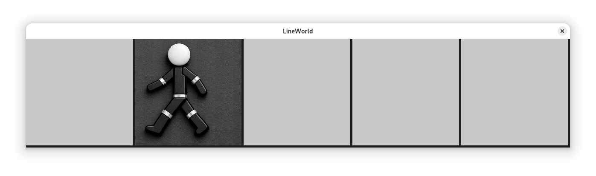
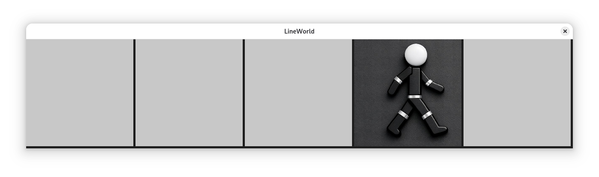
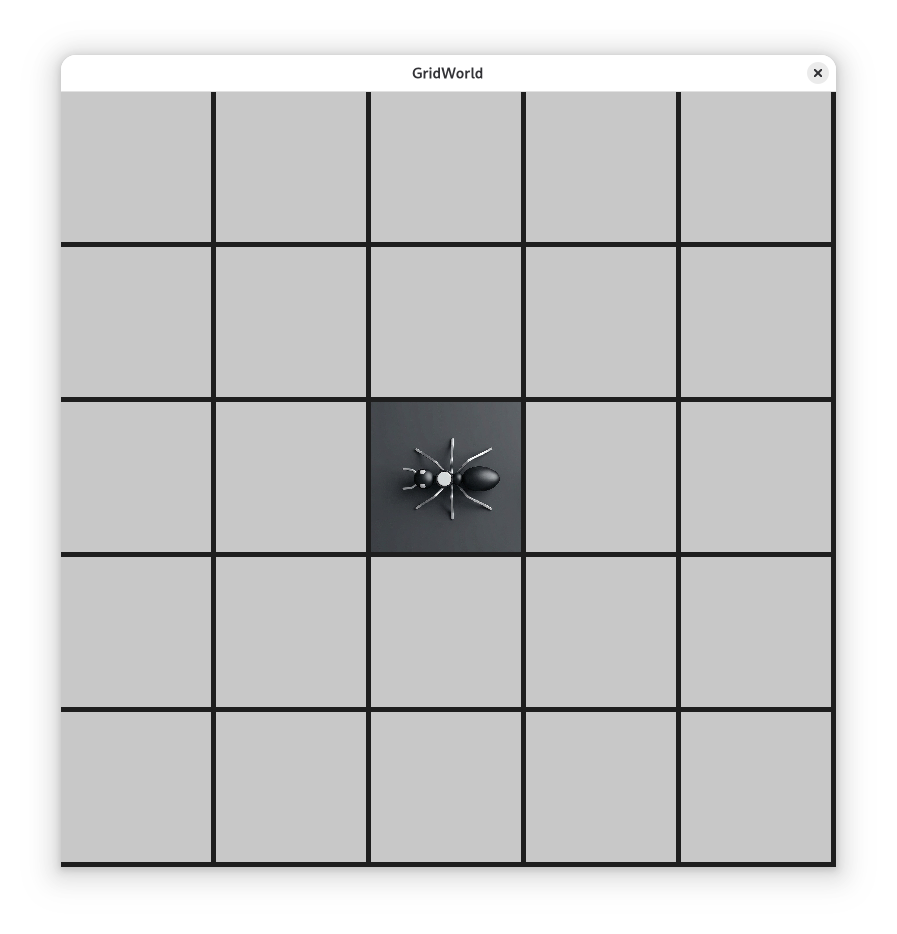
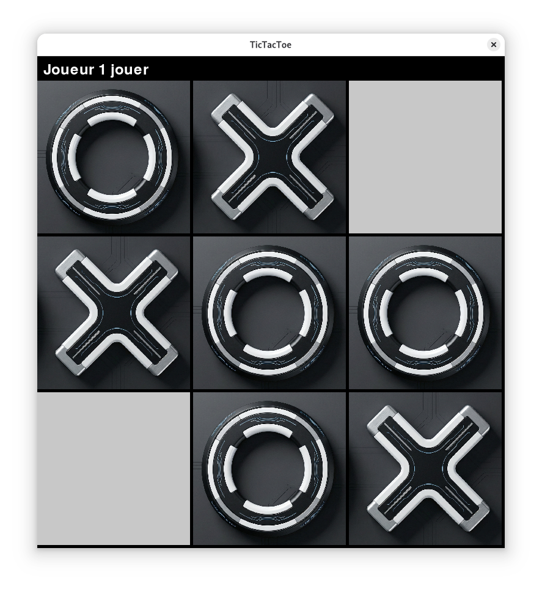
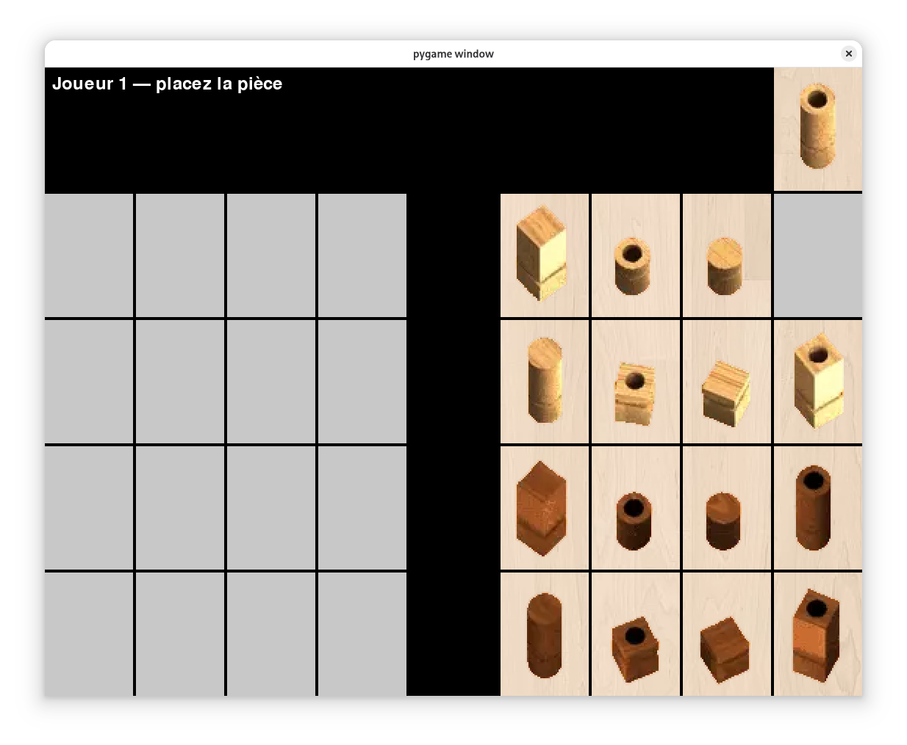
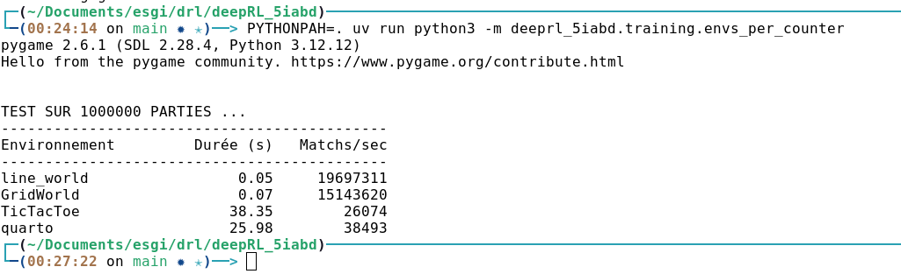

> # Documents de spécifications (encoding vectors)
> ## RENDU Etape intermédiaire (Adam,Ayman,Tom)

# Instalation:

| Action                    | Commande                                                                 |
|---------------------------|--------------------------------------------------------------------------|
| **clonner le projet**     | `git clone git@github.com:yahia-adam/deepRL_5iabd.git && cd deepRL_5iabd`|
| **Installer les dépendances** | `uv sync`                                                            |
| **Activer l'environement** | `source .venv/bin/activate`                                             |
| **Lancer un script**      | `uv run python -m mypythonlib.envs.quarto`                               |

---

# Line world

## Jeu avec Joueur humain + GUI

```bash
PYTHONPATH=. uv run python3 -m deeprl_5iabd.envs.line_world
```





## Proposition de description de l'état du jeu (vecteur d'encoding)

vecteur de 1 valeur la position de l’agent, pourquoi un vecteur pour que tous mes envs aille les meme methode avec les meme signature (baseEnv clasee parent)

```py
def get_observation_space(self) -> list[int]:
    return [self.agent_pos]
```

## Proposition de description d'une action du jeu (vecteur d'encoding)
 
vecteur de 2 valeurs [gauche, droit]
- [0,1] quand l'agent est a la case 0
- [1,1] quand l'agent est entre 1 et la case 3
- [0,1] quand l'agent est a la case 4

```py
    def get_action_space(self) -> list[int]:
        """0: gauche, 1: droite"""
        action = [1,1]
        if self.agent_pos == 0:
            action[0] = 0
        if self.agent_pos == 4:
            action[1] = 0
        return action
```
# Grid World

## Jeu avec Joueur humain + GUI
```bash
PYTHONPATH=. uv run python3 -m deeprl_5iabd.envs.grid_world
```


## Proposition de description de l'état du jeu (vecteur d'encoding)

Vecteur de **25 valeurs** représentant le plateau 5×5, rempli de `-1` partout sauf à la position de l'agent où la valeur est `1`.

```py
def get_observation_space(self):
    return self.board.flatten().tolist()
```

## Proposition de description d'une action du jeu (vecteur d'encoding)
Vecteur de **4 valeurs** `[bas, haut, droite, gauche]`, chaque valeur vaut `1` si l'action est disponible, `0` sinon.

Exemples :
- `[1, 0, 1, 0]` quand l'agent est en haut à gauche (case (0,0))
- `[1, 1, 1, 1]` quand l'agent est au centre (case (2,2))

```py
def get_action_space(self) -> list[int]:
    picks = np.ones(4)
    if self.agent_pos[0] == 0:
        picks[1] = 0
    if self.agent_pos[1] == 0:
        picks[3] = 0
    if self.agent_pos[0] == self.BOARD_SIZE - 1:
        picks[0] = 0
    if self.agent_pos[1] == self.BOARD_SIZE - 1:
        picks[2] = 0
    return picks.tolist()
```

# Tic-Tac-Toe

## Jeu avec Joueur humain + GUI
```bash
PYTHONPATH=. uv run python3 -m deeprl_5iabd.envs.tictactoe
```



## Proposition de description de l'état du jeu (vecteur d'encoding)

Vecteur de **9 valeurs** représentant le plateau 3×3:
- `-1` quand la case est vide
- `0` quand la case est occupée par le joueur O (joueur 0)
- `1` quand la case est occupée par le joueur X (joueur 1)

```py
def get_observation_space(self) -> np.ndarray:
    return self.board.flatten().tolist()
```

## Proposition de description d'une action du jeu (vecteur d'encoding)

Vecteur de **9 valeurs**, une par case du plateau :
- `1` quand la case est **vide** (action jouable)
- `0` quand la case est **occupée** (action non disponible)

```py
def get_action_space(self):
    return (self.board.flatten() == -1).astype(int)
```

# Quarto

## Jeu avec Joueur humain + GUI
```bash
PYTHONPATH=. uv run python3 -m deeprl_5iabd.envs.quarto
```



## Proposition de description de l'état du jeu (vecteur d'encoding)

Vecteur de **132 valeurs** :

| Index | Contenu |
|---|---|
| `[0:4]` | Pièce actuellement sélectionnée (4 attributs), ou `[-1,-1,-1,-1]` si aucune |
| `[4:68]` | Plateau 4×4 (16 cases × 4 valeurs) : `-1` si vide, sinon les 4 attributs de la pièce |
| `[68:132]` | Pièces restantes (16 pièces × 4 valeurs) : `-1` si déjà jouée, sinon ses 4 attributs |

```py
def get_observation_space(self) -> list[int]:
    return self.selected.tolist() + self.board.flatten().tolist() + self.available.flatten().tolist()
```
## Proposition de description d'une action du jeu (vecteur d'encoding)

Vecteur de **32 valeurs** :

| Index | Contenu |
|---|---|
| `[0:16]` | **Choisir une pièce** : `1` si la pièce est disponible, `0` sinon |
| `[16:32]` | **Placer une pièce** : `1` si la case est vide, `0` sinon |

Selon la phase de jeu, une moitié du vecteur est automatiquement à `0` :
- Phase **sélection** (`selecting=True`) : `[16:32]` vaut tout `0` (pas de placement possible)
- Phase **placement** (`selecting=False`) : `[0:16]` vaut tout `0` (pas de choix de pièce possible)

```py

def get_action_space(self) -> list[int]:
    """0-15: choisir pièce, 16-31: placer pièce"""
    empty = [0] * self.NUM_PIECES

    if self.selecting:
        picks = [0 if self.available[r, c, 0] == -1 else 1 for r in range(4) for c in range(4)]
        return  picks + empty
    else:
        picks = [1 if self.board[r, c, 0] == -1 else 0 for r in range(4) for c in range(4)]
        return  empty + picks
```

# Simulation de jeu avec joueur random (calculer le nombre de parties / seconde)

```bash
PYTHONPAH=. uv run python3 -m deeprl_5iabd.training.envs_per_counter  
```

On teste 1 000 000 parties jouées par un agent aléatoires sur chaque environnement.

- **LineWorld / GridWorld** : ~15–20M parties/sec.
- **TicTacToe** : ~26K parties/sec.
- **Quarto** : ~38K parties/sec, légèrement plus rapide que TicTacToe je sais pas Pourquoi :).




```py
def count_n_match_time(env: BaseEnv, num_episode):
    player = RandomPlayer(action_dim=len(env.get_action_space()))
    s = perf_counter()
    
    i = 0
    while (i <= num_episode):
        while (not env.is_game_over()):
            action_spaces = env.get_action_space()
            probs = player.forward(x=None, mask=action_spaces)
            probs_dist = Categorical(probs)
            action_pos = probs_dist.sample()
            env.step(action_pos.item())
        i += 1
    e = perf_counter()

    total_time = e - s
    match_per_s = num_episode / total_time
    return total_time, match_per_s
```
